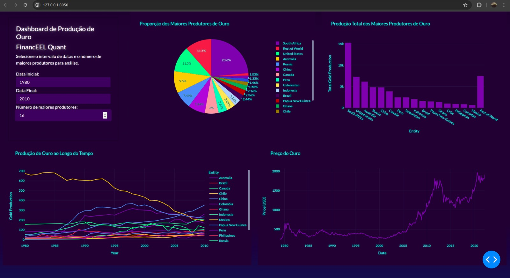

# Gold Production Dashboard

Este projeto é uma dashboard interativa criada usando o framework Dash e Plotly para visualizar dados de produção de ouro e preço do ouro ao longo do tempo. A dashboard permite aos usuários selecionar intervalos de datas e o número de maiores produtores para análise.

## Visão Geral

A dashboard é composta por dois painéis principais:

1. **Painel de Controle:** Contém entradas para selecionar o intervalo de datas e o número de maiores produtores de ouro para análise.
2. **Visualizações:** Inclui gráficos interativos que mostram a proporção dos maiores produtores de ouro, a produção total de ouro dos maiores produtores, a produção de ouro ao longo do tempo, e o preço do ouro ao longo do tempo.

## Tecnologias Utilizadas

- Python
- Dash
- Plotly
- Pandas
- Dash Bootstrap Components

## Layout da Dashboard

### Estrutura

- A primeira linha contém:
  - Um card de controle na primeira coluna.
  - Dois gráficos (Pie Chart e Bar Chart) nas colunas seguintes.
- A segunda linha contém:
  - Dois gráficos (Line Chart e Gold Price Chart).

### Imagem da Dashboard

